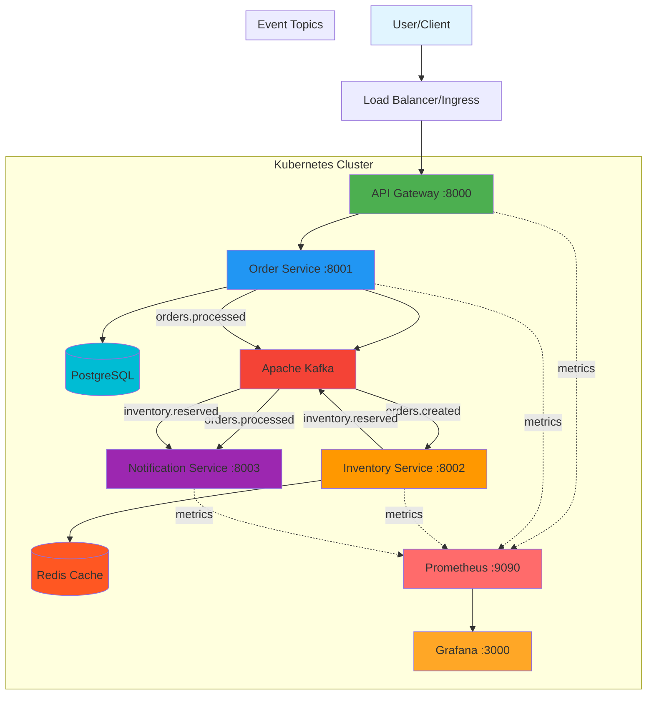

# Event-Driven Cloud-Native Microservices Platform

A production-grade event-driven microservices platform built with Python FastAPI, Apache Kafka, Redis, PostgreSQL, Docker, Kubernetes, and AWS EKS. Includes complete infrastructure as code, CI/CD pipelines, and observability stack.

## Architecture Overview

This platform demonstrates enterprise-level microservices architecture with event-driven communication, scalable infrastructure, and production-ready observability.

### Architecture Diagram



## Microservices

### 1. API Gateway Service
- **Port**: 8000
- **Purpose**: Entry point for all client requests
- **Technology**: FastAPI
- **Responsibilities**:
  - Route requests to appropriate services
  - Request validation
  - API versioning
  - Metrics exposure

### 2. Order Service
- **Port**: 8001
- **Purpose**: Manage order lifecycle
- **Technology**: FastAPI + PostgreSQL
- **Responsibilities**:
  - Create and manage orders
  - Persist order data
  - Publish order events to Kafka
- **Events Published**:
  - `orders.created` - When new order is created
  - `orders.processed` - When order processing completes

### 3. Inventory Service
- **Port**: 8002
- **Purpose**: Manage product inventory
- **Technology**: FastAPI + Redis
- **Responsibilities**:
  - Track inventory levels
  - Reserve inventory for orders
  - Cache inventory state in Redis
- **Events Consumed**: `orders.created`
- **Events Published**: `inventory.reserved`

### 4. Notification Service
- **Port**: 8003
- **Purpose**: Send notifications
- **Technology**: FastAPI
- **Responsibilities**:
  - Process notification events
  - Send email/SMS notifications (simulated)
- **Events Consumed**:
  - `orders.processed`
  - `inventory.reserved`

## Event Flow

1. **Order Creation Flow**:
   ```
   User → API Gateway → Order Service → PostgreSQL
                                     ↓
                                   Kafka (orders.created)
                                     ↓
                              Inventory Service → Redis
                                     ↓
                                   Kafka (inventory.reserved)
                                     ↓
                              Notification Service
   ```

2. **Order Processing Flow**:
   ```
   Order Service → Kafka (orders.processed) → Notification Service
   ```

## Technology Stack

### Core Services
- **Language**: Python 3.11
- **Framework**: FastAPI
- **Event Streaming**: Apache Kafka
- **Databases**: PostgreSQL, Redis
- **API Documentation**: OpenAPI/Swagger

### Infrastructure
- **Containerization**: Docker
- **Orchestration**: Kubernetes
- **Cloud Platform**: AWS EKS
- **IaC**: Terraform
- **CI/CD**: GitHub Actions

### Observability
- **Metrics**: Prometheus
- **Visualization**: Grafana
- **Logging**: Structured JSON logs

## Project Structure

```
Event-Driven-Cloud-Native-Microservices-Platform/
├── services/
│   ├── api-gateway/
│   │   ├── app/
│   │   │   ├── api/
│   │   │   ├── core/
│   │   │   ├── schemas/
│   │   │   └── main.py
│   │   ├── tests/
│   │   ├── Dockerfile
│   │   └── requirements.txt
│   ├── order-service/
│   ├── inventory-service/
│   └── notification-service/
├── infrastructure/
│   └── terraform/
│       ├── modules/
│       │   ├── vpc/
│       │   ├── eks/
│       │   └── networking/
│       └── environments/
│           └── dev/
├── kubernetes/
│   ├── base/
│   ├── deployments/
│   ├── services/
│   ├── configmaps/
│   ├── secrets/
│   └── ingress/
├── observability/
│   ├── prometheus/
│   └── grafana/
├── scripts/
│   ├── setup.sh
│   ├── run_local.sh
│   └── deploy.sh
├── .github/
│   └── workflows/
│       └── ci-cd.yaml
└── docker-compose.yml
```

## Local Development

### Prerequisites
- Python 3.11+
- Docker & Docker Compose
- Git

### Setup

1. **Clone the repository**:
   ```bash
   git clone <repository-url>
   cd Event-Driven-Cloud-Native-Microservices-Platform
   ```

2. **Run setup script**:
   ```bash
   ./scripts/setup.sh
   ```

3. **Activate virtual environment**:
   ```bash
   source venv/bin/activate
   ```

4. **Start services locally**:
   ```bash
   ./scripts/run_local.sh
   ```

### Access Services

- **API Gateway**: http://localhost:8000
- **API Documentation**: http://localhost:8000/docs
- **Order Service**: http://localhost:8001
- **Inventory Service**: http://localhost:8002
- **Notification Service**: http://localhost:8003
- **Prometheus**: http://localhost:9090
- **Grafana**: http://localhost:3000 (admin/admin)

### Testing the Platform

1. **Create an order**:
   ```bash
   curl -X POST http://localhost:8000/api/v1/orders \
     -H "Content-Type: application/json" \
     -d '{
       "product_id": "prod-123",
       "quantity": 2,
       "customer_id": "cust-456"
     }'
   ```

2. **Get order status**:
   ```bash
   curl http://localhost:8000/api/v1/orders/{order_id}
   ```

3. **View logs**:
   ```bash
   docker-compose logs -f
   ```

## Kubernetes Deployment

### Prerequisites
- kubectl
- AWS CLI
- Terraform
- Docker

### Infrastructure Provisioning

1. **Navigate to Terraform directory**:
   ```bash
   cd infrastructure/terraform/environments/dev
   ```

2. **Initialize Terraform**:
   ```bash
   terraform init
   ```

3. **Plan infrastructure**:
   ```bash
   terraform plan
   ```

4. **Apply infrastructure**:
   ```bash
   terraform apply
   ```

5. **Configure kubectl**:
   ```bash
   aws eks update-kubeconfig --name microservices-cluster --region us-east-1
   ```

### Deploy to Kubernetes

1. **Build and tag Docker images**:
   ```bash
   docker build -t api-gateway:latest ./services/api-gateway
   docker build -t order-service:latest ./services/order-service
   docker build -t inventory-service:latest ./services/inventory-service
   docker build -t notification-service:latest ./services/notification-service
   ```

2. **Deploy to cluster**:
   ```bash
   ./scripts/deploy.sh
   ```

3. **Verify deployment**:
   ```bash
   kubectl get pods -n microservices
   kubectl get svc -n microservices
   ```

4. **Access API Gateway**:
   ```bash
   kubectl get svc api-gateway -n microservices
   ```

## CI/CD Pipeline

The platform includes a complete GitHub Actions pipeline with the following stages:

### Pipeline Stages

1. **Lint**: Code quality checks with flake8 and black
2. **Test**: Run unit and integration tests
3. **Build**: Build Docker images for all services
4. **Push**: Push images to Amazon ECR
5. **Deploy**: Deploy to EKS cluster

### Required Secrets

Configure these secrets in GitHub repository settings:
- `AWS_ACCESS_KEY_ID`
- `AWS_SECRET_ACCESS_KEY`

### Trigger Pipeline

Pipeline runs automatically on:
- Push to `main` or `develop` branches
- Pull requests to `main` branch

## Observability

### Prometheus Metrics

All services expose metrics at `/metrics` endpoint:
- HTTP request duration
- Request count
- Error rates
- Custom business metrics

### Grafana Dashboards

Access Grafana at http://localhost:3000 (local) or via LoadBalancer (K8s):
- **Username**: admin
- **Password**: admin

Pre-configured dashboards:
- Service health overview
- Request rates and latency
- Error tracking
- Kafka metrics

### Structured Logging

All services use JSON structured logging:
```json
{
  "timestamp": "2024-01-15T10:30:00Z",
  "level": "INFO",
  "service": "order-service",
  "message": "Order created",
  "module": "order_service"
}
```

## API Endpoints

### API Gateway

#### Create Order
```http
POST /api/v1/orders
Content-Type: application/json

{
  "product_id": "prod-123",
  "quantity": 2,
  "customer_id": "cust-456"
}
```

#### Get Order
```http
GET /api/v1/orders/{order_id}
```

#### Health Check
```http
GET /health
```

### Service Health Endpoints

- API Gateway: `GET http://localhost:8000/health`
- Order Service: `GET http://localhost:8001/health`
- Inventory Service: `GET http://localhost:8002/health`
- Notification Service: `GET http://localhost:8003/health`

## Testing

### Run All Tests
```bash
pytest services/*/tests/ -v
```

### Run Service-Specific Tests
```bash
cd services/api-gateway
pytest tests/ -v --cov=app
```

### Test Coverage
```bash
pytest --cov=app --cov-report=html
```

## Security

### Implemented Security Measures

1. **Environment Variables**: Sensitive data stored in environment variables
2. **Kubernetes Secrets**: Database credentials managed via K8s secrets
3. **Network Policies**: Service-to-service communication restrictions
4. **Resource Limits**: CPU and memory limits on all containers
5. **Health Checks**: Liveness and readiness probes
6. **CORS**: Configured CORS policies

## Monitoring & Alerts

### Key Metrics to Monitor

- **Service Health**: Uptime and availability
- **Request Latency**: P50, P95, P99 percentiles
- **Error Rates**: 4xx and 5xx responses
- **Kafka Lag**: Consumer lag monitoring
- **Database Connections**: Connection pool utilization
- **Resource Usage**: CPU and memory consumption

## Scaling

### Horizontal Pod Autoscaling

```bash
kubectl autoscale deployment api-gateway \
  --cpu-percent=70 \
  --min=2 \
  --max=10 \
  -n microservices
```

### Manual Scaling

```bash
kubectl scale deployment order-service --replicas=5 -n microservices
```

## Troubleshooting

### View Logs
```bash
kubectl logs -f deployment/order-service -n microservices
```

### Debug Pod
```bash
kubectl exec -it <pod-name> -n microservices -- /bin/sh
```

### Check Events
```bash
kubectl get events -n microservices --sort-by='.lastTimestamp'
```

### Restart Service
```bash
kubectl rollout restart deployment/order-service -n microservices
```

## Future Improvements

1. **Service Mesh**: Implement Istio for advanced traffic management
2. **API Gateway Enhancement**: Add rate limiting and authentication
3. **Database Replication**: PostgreSQL read replicas
4. **Caching Layer**: Distributed caching with Redis Cluster
5. **Message Queue**: Add dead letter queues for failed events
6. **Tracing**: Implement distributed tracing with Jaeger
7. **Security**: Add OAuth2/JWT authentication
8. **GitOps**: Integrate ArgoCD for GitOps workflows
9. **Chaos Engineering**: Implement chaos testing
10. **Multi-Region**: Deploy across multiple AWS regions
11. **Service Discovery**: Implement Consul for service discovery
12. **API Versioning**: Enhanced API version management
13. **Circuit Breaker**: Add Resilience4j patterns
14. **Event Sourcing**: Implement event sourcing pattern
15. **CQRS**: Separate read and write models

## Contributing

1. Fork the repository
2. Create a feature branch
3. Commit changes with meaningful messages
4. Push to the branch
5. Create a Pull Request

## License

MIT License

## Contact

For questions or support, please open an issue in the repository.

---

**Built with ❤️ using modern cloud-native technologies**
